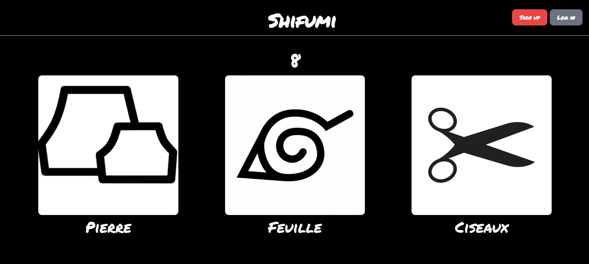

# SHIFUMI 

 
Pour installer l'environnement d'execution :  
conda create env_name python=3.10  
conda activate env_name  

Se placer dans le dossier :  
python manage.py runserver

 
Projet de réalisation d'une application de jeu Pierre-Feuille-Ciseaux. 
L'application est composée de 2 jeux :  
- Shifumi Click' ( juste un formulaire)  
- Shifumi Stream' ( Computer Vision Shifumi )  
 

 

# Shifumi Portail 
Page d'accueil :  
 

 

Page de choix du jeu :  
 

## Shifumi Click'
L'utilisateur choisit son coup en moins de 10 secondes ( que se passera-t-il s'il ne le fait pas ?)
 

 

 

 

## Shifumi Stream'

L'utilisateur clique sur le bouton jouer, 5 secondes plus tard la photo sera prise. 
Sur un fond noir, la personne montre le coup qu'elle doit jouer avec sa main. 
 

